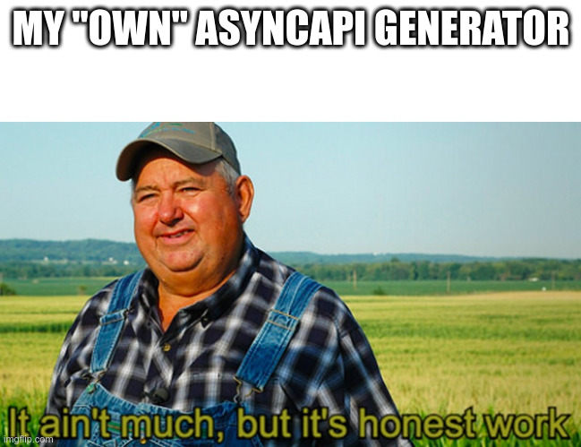

# Short and sweet

## AsyncAPI Intro & AsyncAPI Generator

---

# Warning

Things you're about to be demonstrated are in early alpha - try them at home and contribute ;)

---

---

# Intro, reason & background

## OpenAPI ???

<!--
OpenAPI is great for REST-like (synchronous) desing-first API design and implementation - is there anything comparable for asynchronous APIs?
-->

---

# Intro, reason & background

## AsyncAPI !!!

<!--
https://www.asyncapi.com/
-->

---

# Intro, reason & background

## AsyncAPI ???

https://www.postman.com/state-of-api/api-technologies/#api-technologies

<!--
Never heard of it? You're not alone.
-->

---

# AsyncAPI

OpenAPI-like definition of asynchronous APIs

---

# AsyncAPI

Supports:

* Kafka
* AMQP
* MQTT
* JMS
* WS
* ...

---

# AsyncAPI

UIs for :

* Spring Boot
* Quarkus

<!--
Couldn't make any of it work for me, but at least Springwolf has a demo site.
-->

---

# Official AsyncAPI Generator

Javascript :(

<!--
Causes lots of problems in current project.
-->

---

# Official AsyncAPI Spring Boot Template

Javascript :(
React :(

<!--
Supports older version of spec, is not suitable as is, not maintainable within project
-->

---

# NIH

Try to start an AsyncAPI Generator using similar stack as OpenAPI Generator

---

# AsyncAPI Generator

## Code & demo time

---

# Links

* https://www.asyncapi.com/
* https://github.com/asyncapi/generator
* https://github.com/asyncapi/java-spring-template
* https://springwolf.github.io/
* https://github.com/quarkiverse/quarkus-asyncapi
* https://www.postman.com/state-of-api/api-technologies/#api-technologies

---

# Links (contd.)

* https://github.com/asyncapi/spec-json-schemas
* https://github.com/coiouhkc/asyncapi-generator
* https://github.com/coiouhkc/asyncapi-generator-examples

---

# Q&A